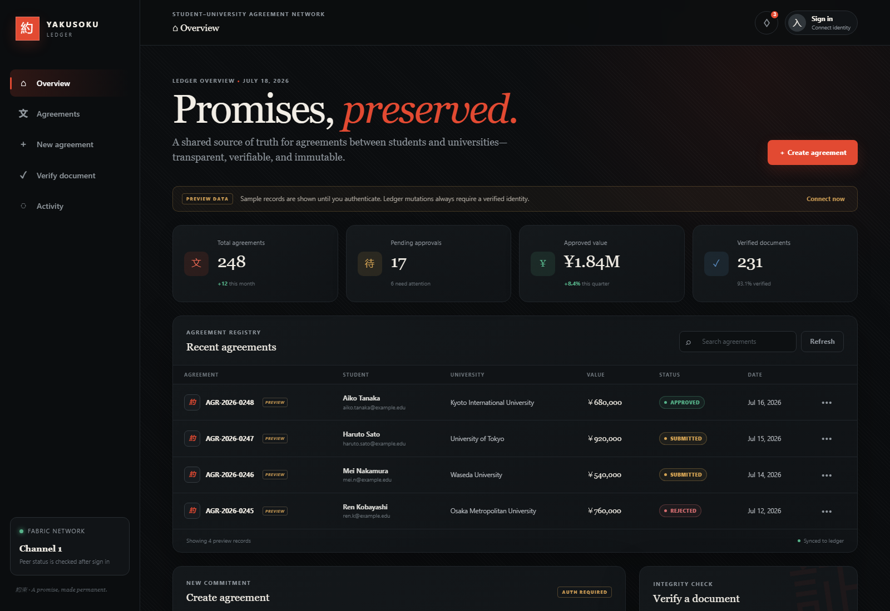
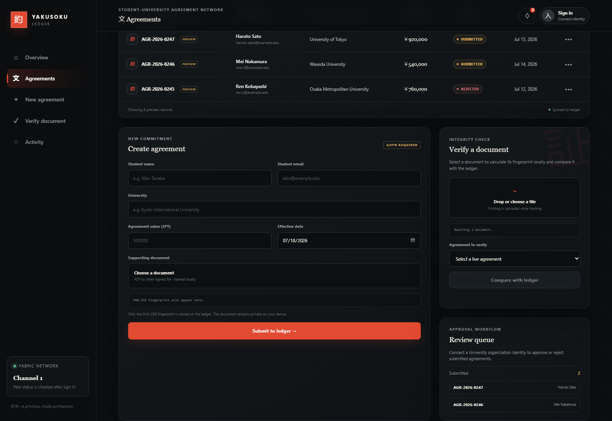
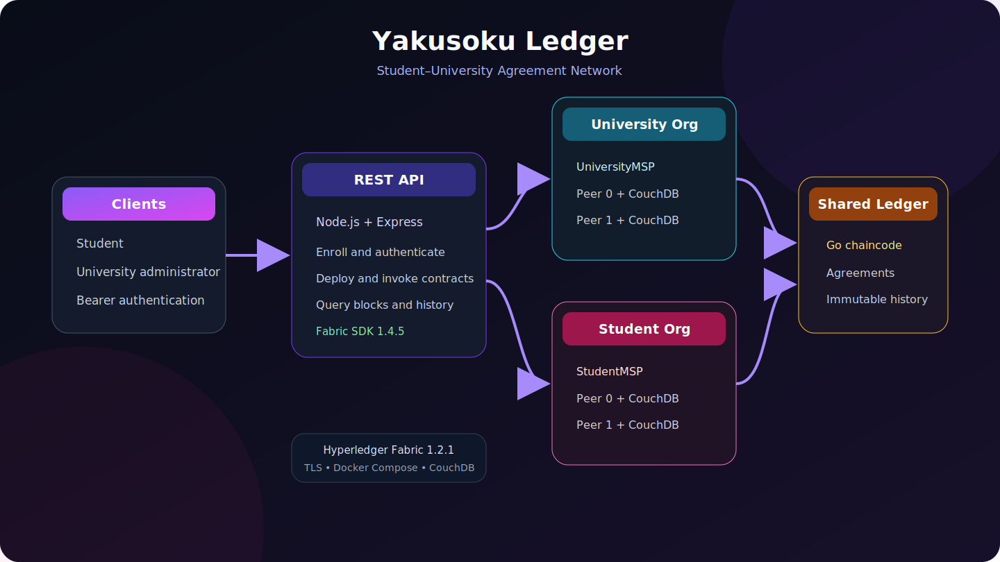

# Yakusoku Ledger

Yakusoku Ledger is a Hyperledger Fabric prototype for recording financial
agreements between students and universities. It provides a full web dashboard,
privacy-preserving document verification, university approvals, immutable audit
history, ledger analytics, and a two-organization Fabric network.

Originally built at CUHackit 2020, the project has been completed and renamed to
**Yakusoku**, the Japanese word for "promise," to reflect the agreements it records.

## Project preview





The dashboard starts with clearly labeled preview records and switches to live ledger
data after identity enrollment.



See [Features and workflows](docs/FEATURES.md) and the [API guide](docs/API.md) for
deeper documentation.

## Features

- Responsive student and university dashboard with live ledger analytics
- Multiple agreements per student/university pair with stable `AGR-...` references
- Exact integer minor-unit money values with explicit ISO currencies
- Student names and emails held in a member-only Fabric private data collection
- Salted public identity commitments and transient-data identity verification
- Client-side SHA-256 document hashing; agreement files never leave the browser
- Draft → student signature → university countersignature → active lifecycle
- Two-party amendments with superseded revision history and deterministic expiration
- Immutable agreement version history and activity notifications
- Role-aware Fabric identity enrollment and network administration
- Single-use expiring invitations, certificate roles, member revocation, and audit events
- Searchable agreement registry with preview mode for portfolio demonstrations

## Architecture

- **University organization:** two Fabric peers and one certificate authority
- **Student organization:** two Fabric peers and one certificate authority
- **Ledger:** Go chaincode backed by CouchDB
- **Web app:** responsive vanilla HTML, CSS, and JavaScript with no package installation
- **API:** Node.js/Express service using the bundled Fabric 1.4.5 SDK
- **Authentication:** enrollment endpoint issuing Bearer JWTs

The chaincode stores random agreement references and non-PII metadata in public
channel state. Student names, emails, and per-agreement salts are distributed only to
the Student and University organizations through a private data collection.

## Prerequisites

This is a legacy Hyperledger Fabric 1.2 application. Use a Linux host or WSL 2 with:

- Docker Engine with the Compose v2 plugin
- Node.js 8.9 or 10.15 (supported by the bundled Fabric 1.4.5 SDK)
- Bash, curl, and jq

The repository includes the Fabric 1.2 command-line binaries used to generate network
artifacts and the Node dependencies needed by the API. They are Linux executables;
no package installation command is required.

## Start the project

To explore the dashboard with preview data before starting Fabric:

```bash
node node1/preview-server.js
```

Then open [http://localhost:4173](http://localhost:4173). Live actions remain disabled
until the complete Fabric API is running.

1. Generate the crypto material and start the Fabric network:

   ```bash
   cd fabric
   ./start.sh
   ```

2. Start the API in another terminal:

   ```bash
   cd node1
   export JWT_SECRET="$(openssl rand -hex 32)"
   node server.js
   ```

3. Confirm that the API is available:

   ```bash
   curl http://localhost:4000/health
   ```

4. Create one-time local bootstrap invitations, then open the dashboard:

   ```bash
   cd node1
   node app/invitation-cli.js create org1 organization_admin 60
   node app/invitation-cli.js create org2 organization_admin 60
   ```

   Enroll each administrator with its returned token at
   [http://localhost:4000](http://localhost:4000).

5. Run the complete enrollment, channel, deployment, invoke, verification, approval,
   and query workflow:

   ```bash
   cd node1
   ./testAPI.sh
   ```

6. Stop the network:

   ```bash
   cd fabric
   ./stop.sh
   ```

`fabric/generate-artifacts.sh` can be run directly to replace all generated
certificates and channel artifacts. Private keys and generated artifacts are ignored
by Git.

## REST API

Except for `GET /health` and `POST /users`, requests require:

```text
Authorization: Bearer <token returned by POST /users>
```

Channel creation, peer joining, installation, and instantiation additionally require an
administrator token. Supply the server's `ADMIN_ENROLLMENT_SECRET` as `adminSecret`
when enrolling the network administrator. Do not expose this secret to normal users.

| Method | Path | Purpose |
| --- | --- | --- |
| `POST` | `/users` | Enroll with a single-use invitation and issue a token |
| `GET/POST` | `/api/members/*` | Manage invitations, members, revocation, and audit events |
| `GET` | `/api/agreements` | List agreements for dashboard analytics |
| `POST` | `/api/agreements` | Submit an agreement and document fingerprint |
| `POST` | `/api/agreements/:id/sign` | Sign or countersign an agreement |
| `POST` | `/api/agreements/:id/amendments` | Propose new active terms |
| `POST` | `/api/agreements/:id/amendments/decision` | Approve or reject an amendment |
| `POST` | `/api/agreements/:id/expire` | Record date-enforced expiration |
| `GET` | `/api/agreements/:id` | Read one agreement |
| `GET` | `/api/agreements/:id/history` | Read its immutable audit history |
| `POST` | `/api/agreements/:id/verify` | Verify a document fingerprint |
| `POST` | `/api/agreements/:id/identity/verify` | Verify an email through transient data |
| `POST` | `/api/agreements/:id/privacy/migrate` | Redact current legacy PII as a Student admin |
| `POST` | `/api/agreements/:id/review` | Approve or reject as a university member |
| `POST` | `/channels` | Create a channel |
| `POST` | `/channels/:channel/peers` | Join organization peers |
| `POST` | `/chaincodes` | Install chaincode |
| `POST` | `/channels/:channel/chaincodes` | Instantiate chaincode |
| `POST` | `/channels/:channel/chaincodes/:name` | Invoke chaincode |
| `GET` | `/channels/:channel/chaincodes/:name` | Query chaincode |
| `GET` | `/channels/:channel/blocks/:number` | Read a block |
| `GET` | `/channels/:channel/blocks?hash=...` | Read a block by hash |
| `GET` | `/channels/:channel/transactions/:id` | Read a transaction |
| `GET` | `/channels/:channel` | Read channel information |
| `GET` | `/chaincodes` | List installed or instantiated chaincode |
| `GET` | `/channels` | List peer channels |

The runnable `node1/testAPI.sh` script contains request examples for the full workflow.

## Chaincode functions

| Function | Arguments | Behavior |
| --- | --- | --- |
| `Init` | none | Initialize or upgrade the chaincode |
| `createAgreement` | reference, effective date, expiration date, amount minor units, currency, university, SHA-256 plus transient PII | Create a draft |
| `signAgreement` | agreement ID | Student-sign or university-countersign |
| `proposeAmendment` | agreement ID and proposed public terms | Propose without changing active terms |
| `decideAmendment` | agreement ID, decision | Apply only after both-party approval |
| `expireAgreement` | agreement ID | Record expiration after `ExpiresOn` |
| `migrateAgreementPII` | agreement ID plus transient PII | Move current legacy PII into the private collection |
| `verifyStudentIdentity` | agreement ID plus transient email | Verify a salted identity commitment |
| `queryByStudentEmail` | email | Find agreements for an email |
| `queryByStudentName` | student name | Find all agreements for a student |
| `queryByUniversityName` | university name | Find all agreements for a university |
| `queryAllAgreements` | none | Return dashboard and analytics records |
| `getHistoryForStudent` | student name, university name | Return agreement history for all v3 agreements matching a student/university pair |
| `getHistoryForStudentLegacy` | student name, university name | *(legacy)* Return agreement history using hash-based key lookup (works only for pre-v3 records) |
| `getHistoryForAgreement` | agreement ID | Return the immutable audit trail for any agreement |
| `getAgreement` | agreement ID | Read an agreement by ID |
| `verifyDocument` | agreement ID, SHA-256 | Compare a local file with the ledger |
| `reviewAgreement` | agreement ID, decision | University approval or rejection |

## Project layout

```text
fabric/                 Fabric network, Docker Compose, and artifact scripts
node1/                  REST API and Fabric Node SDK integration
node1/public/           Responsive web dashboard
src/chaincode/          Student-university agreement chaincode
docs/                   Screenshots and deeper product documentation
```

Existing hash-keyed records and legacy `Amount` values remain readable. See the
[privacy design](docs/PRIVACY.md) and [migration guide](docs/MIGRATION.md) before
upgrading a running network.

## Configuration

- `HOST` and `PORT` override the API listener.
- `JWT_SECRET` sets the signing secret. If omitted, a random development secret is
  created on startup.
- `IDENTITY_GOVERNANCE_STORE` places invitation, membership, and audit state on
  durable storage instead of the default `node1/tmp` path.
- `KEY_VALUE_STORE` overrides the Fabric client credential store.
- `TARGET_NETWORK` selects an alternate `node1/app/network-config-<name>.json`.

See [Identity governance](docs/IDENTITY_GOVERNANCE.md) for certificate roles,
bootstrap, revocation, and recovery requirements.

## License

Apache-2.0
